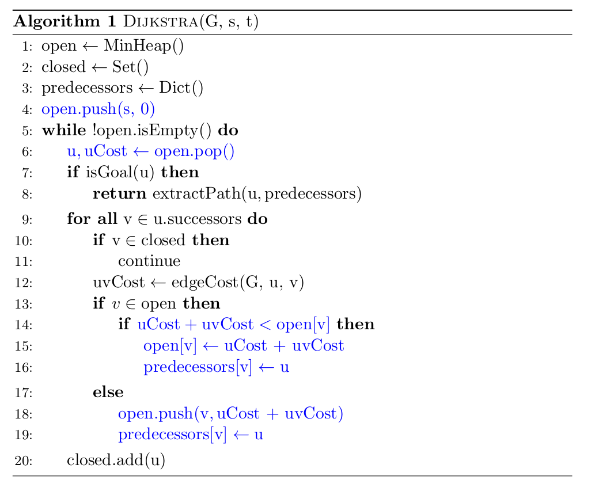
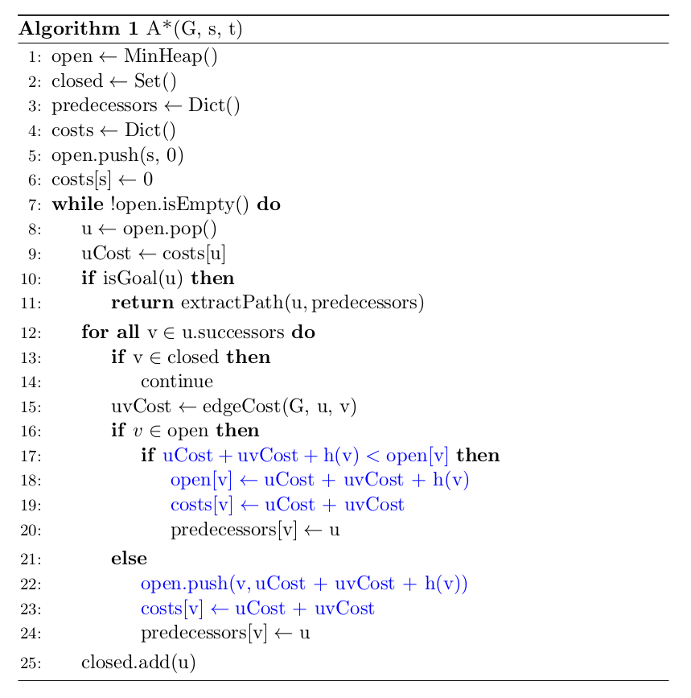
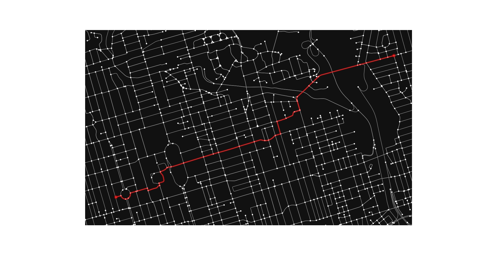

# Dijkstra's and A* Search Algorithms
This project provides a Python Class of the Dijkstra's and 
A* Search Algorithms.

The RoutePlanner class offers two options of distance 
heuristic. Depending on the selection of the distance heuristic,
this class performs either A* search or Dijkstra search.

When this heuristic is set to Euclidean, this
class performs A* search with the Euclidean distance heuristic. 
When it is set to zero, this class essentially performs Dijkstra
search.

# Usage
Execute the following command in a terminal: `python3 main.py`

The example code will show the route planning result between 
two locations near Downtown Toronto.

# Reference
LaValle, Steven M. [Planning Algorithms](http://citeseerx.ist.psu.edu/viewdoc/download?doi=10.1.1.225.1874&rep=rep1&type=pdf). Cambridge University Press, 2006.